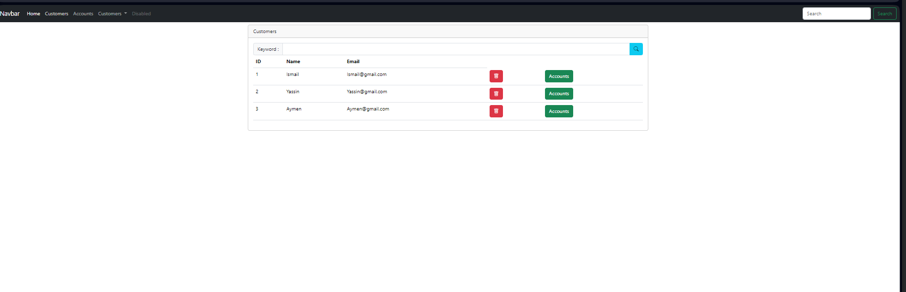
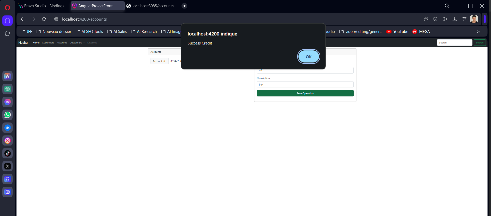
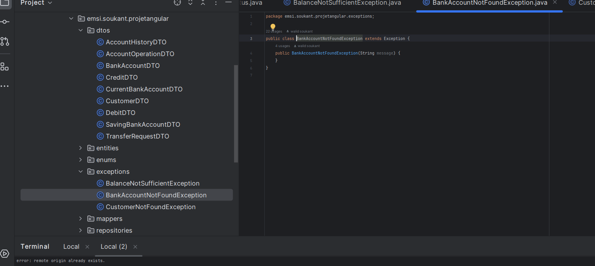
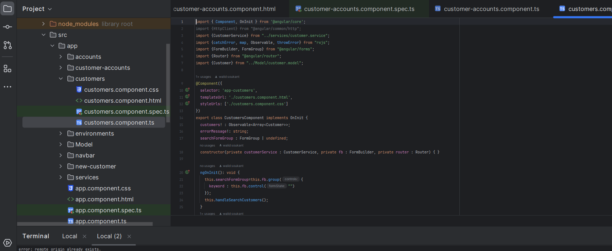

# Description Générale

L'application permet de gérer différents types de comptes bancaires, notamment les comptes courants et les comptes épargne, avec des caractéristiques spécifiques pour chaque type. 
Elle garde un historique détaillé des opérations effectuées sur chaque compte et permet aux clients de gérer plusieurs comptes sous un seul profil.

# Backend (Spring Boot)

L'architecture du backend suit une approche en couches, comprenant les contrôleurs, les services, les repositories, les entités, et les objets de transfert de données (DTO).

## Contrôleurs :
Gèrent les requêtes entrantes, les vérifications de paramètres, et dirigent les requêtes vers les services appropriés.

## Services :
Contiennent la logique métier essentielle, gérant la création de comptes, l'exécution des opérations, et la gestion des informations clients.

## Repositories :

Interagissent avec la base de données pour effectuer des opérations CRUD, offrant une abstraction de la couche de persistance.

## Entités :
Représentent les objets métier et sont mappées sur des tables de base de données, définissant la structure des données.

## DTO :
Facilitent le transfert de données entre le backend et le frontend, en encapsulant les informations nécessaires de manière structurée.

# Frontend (Angular)

L'architecture du frontend repose sur une approche composant, incluant des composants, des services, et des modèles.

## Composants :
Chargés du rendu de l'interface utilisateur et de la gestion des interactions de l'utilisateur, créant une interface modulaire et maintenable.

## Services :
Gèrent la communication avec les API du backend, effectuant des requêtes HTTP pour récupérer et mettre à jour les données nécessaires.

## Modèles :
Représentations structurées des données utilisées dans l'application, assurant une cohérence avec les DTO du backend.

# Fonctionnalités Clés

## Gestion des Comptes :
Création et gestion des comptes courants et épargne, chaque type ayant des attributs spécifiques (découvert autorisé pour les comptes courants, taux d'intérêt pour les comptes épargne).

## Historique des Opérations :
Suivi détaillé des transactions avec identifiant unique, date, montant, description, type d'opération, et solde après chaque transaction.

## Gestion des Clients :
Enregistrement des clients avec identifiant, nom, et adresse e-mail, et possibilité de gérer plusieurs comptes bancaires sous un seul profil.

# Avantages de l'Architecture Utilisée

## Modularité :
Grâce à la séparation claire des responsabilités entre les différentes couches et composants.

## Évolutivité :
Facilite l'ajout de nouvelles fonctionnalités sans affecter les autres parties de l'application.

## Maintenabilité : 
Le code est bien structuré, ce qui rend l'application plus facile à maintenir et à dépanner.

## Communication Efficace :
Les DTO et les services du frontend assurent une communication fluide et cohérente entre le backend et le frontend.

<h3>Compte Rendu</h3>

